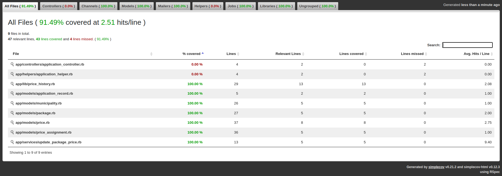
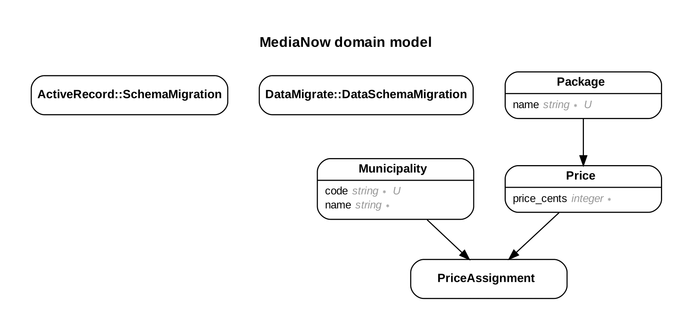

# Coding Assignment Solution

```sh
$ rspec spec/
........................

Finished in 0.14053 seconds (files took 0.94261 seconds to load)
24 examples, 0 failures
```


```
payments-assignment $ rails db:create
payments-assignment $ rails db:migrate:with_data
payments-assignment $ rails db:seed
```

